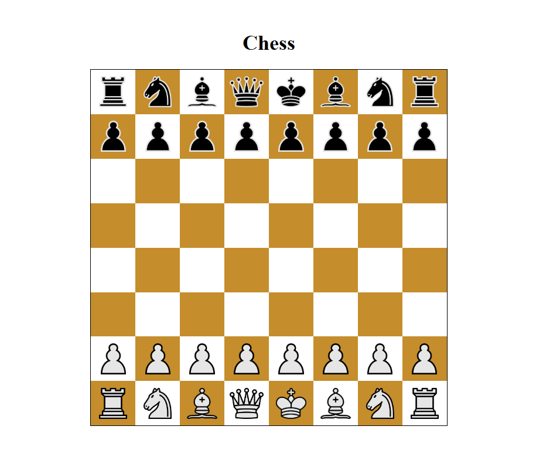
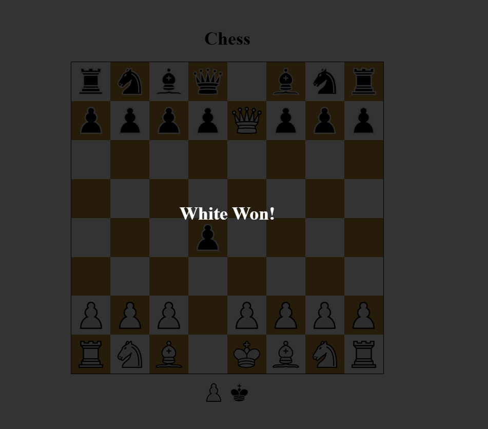

# Chess Application

A simple chess application built using JavaScript that supports basic piece movement and validations. This project is intended as a demonstration of how chess logic can be implemented, focusing on specific pieces like rooks, pawns, etc.

## Features
- Full chessboard layout.
- Rook movement with proper validations.
- Capture and move logic.
- Modular design for extending to other chess pieces.

## Setup and Usage

### Prerequisites
- A browser (Chrome, Firefox, Edge, etc.).
- Optionally, a code editor like VS Code for viewing the source files.

### Steps to Run
1. Clone or download the repository to your local machine.
2. Open the `index.html` file located in the `src` folder using one of the following methods:
   - **With Live Server:**
     - Open the project in VS Code.
     - Right-click on `index.html` in the `src` folder and select **Open with Live Server**.
   - **Directly in Browser:**
     - Navigate to the `src` folder in your file explorer.
     - Double-click on the `index.html` file to open it in your default browser.

### Screenshots




## Folder Structure
```
chess-app/
├── src/
│   ├── index.html
│   ├── styles.css
│   ├── main.js
│   ├── assets/
│   │   ├── images/
├── screenshots/
│   ├── chess-board.png
│   ├── rook-movement.png
├── README.md
```

## Future Improvements
- Create a more visually appealing UI.
- Add multiplayer support.